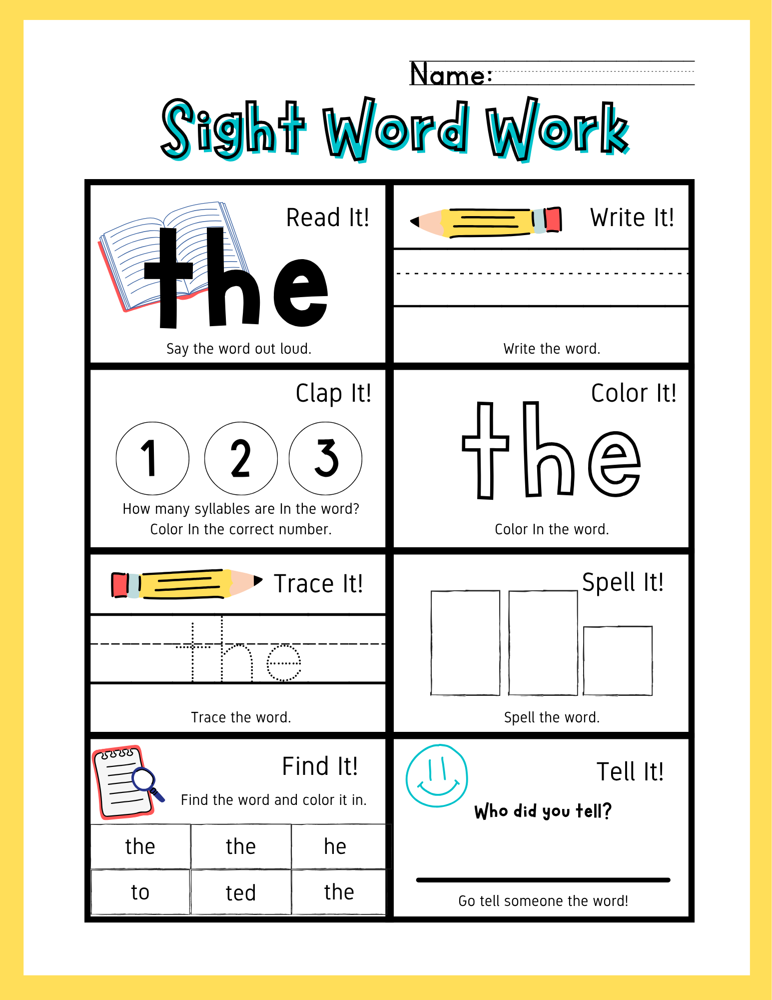

# Word Work Generator (高保真单词工作表生成器)

这是一个专为英语教育设计的交互式 A4 工作表生成系统。它能够根据您输入的任意单词，通过高精度算法实时生成包含八大核心教学模块的专业练习纸，并支持出版级的 PDF 打印效果。

## 🚀 项目核心亮点

### 1. **高精度矢量渲染引擎 (Trace It!)**
- **像素级三线格对齐**：放弃了不稳定的 CSS 背景线方案，改用 **SVG 矢量坐标系统** 渲染线条。
- **字体度量校准**：通过 Canvas 实时测量 `Nunito` 字体的 `x-height`，确保小写字母 'e' 完美压在虚线上，长字母触及顶线，实现真正的“规范书写”效果。
- **矢量点阵填充**：使用 SVG Pattern 技术生成的点阵词，彻底解决“镂空字体”在打印时的视觉干扰。

### 2. **智能字形识别系统 (Spell It!)**
- **Elkonin Boxes 自动化**：程序会自动检测每个字母的物理高度。
  - **高耸框**：适用于 `h`, `t`, `b` 等带升部的字母。
  - **下沉框**：适用于 `g`, `p`, `y` 等带降部的字母。
  - **普通框**：适用于 `a`, `c`, `e` 等常规字母。

### 3. **高迷惑性单词查找器 (Find It!)**
- **同首字母干扰算法**：系统会根据目标词的首字母，从内置的 26 组 Sight Words 词库中动态提取具有高度视觉相似性的干扰词。
- **无缝网格布局**：3x2 宽幅六宫格设计，横向边线完全对齐功能框边界，具备极高的视觉严整性。

### 4. **自动化版权保护系统 (Watermark)**
- **变量驱动设计**：只需在 CSS 的 `:root` 变量中修改一次文字内容，全页面的 **24 处对齐平铺水印** 将同步更新。
- **非侵入式叠加**：采用顶层悬浮、透明度 0.05 的优雅设计，保护原创版权的同时不产生任何操作干扰。

## 🛠️ 功能模块一览
*   **Read It!**: 超大字号核心词展示。
*   **Write It!**: 纯净的三线格书写区。
*   **Clap It!**: 针对音节划分的动态打卡圆圈。
*   **Color It!**: 专为蜡笔设计的艺术空心临摹文字。
*   **Trace It!**: 矢量级点阵规范临摹。
*   **Spell It!**: 基于字形逻辑的拼写框。
*   **Find It!**: 具有深度迷惑性的相似词辨析网格。
*   **Tell It!**: 书写互动激励区域。

## 📄 打印与使用指南

### 使用步骤
1.  **打开项目**：双击 `index.html` 即可在 Chrome、Edge 等现代浏览器中运行。
2.  **生成**：在顶部输入框输入单词（支持长词自动缩放），点击“生成工作表”。
3.  **打印**：点击“打印”按钮或快捷键 `Ctrl+P / Cmd+P`。

### 打印设置建议 (Chrome)
- **纸张大小**：A4
- **边距**：无 (None)
- **比例**：100%
- **选项**：必须勾选 **“背景图形” (Background graphics)** 以确保黄色边框和水印正常显示。

## 🎨 视觉规范
- **字体族**：Bubblegum Sans (装饰), Nunito (标准书写), Raleway Dots (临摹点阵)。
- **核心色值**：雅黄色 (#fdd835), 蒂芙尼绿 (#4dd0e1), 极简黑 (#000000)。

---
*由 terry校长 设计开发 - 致力于为教育创作者提供最极致的生成方案*
